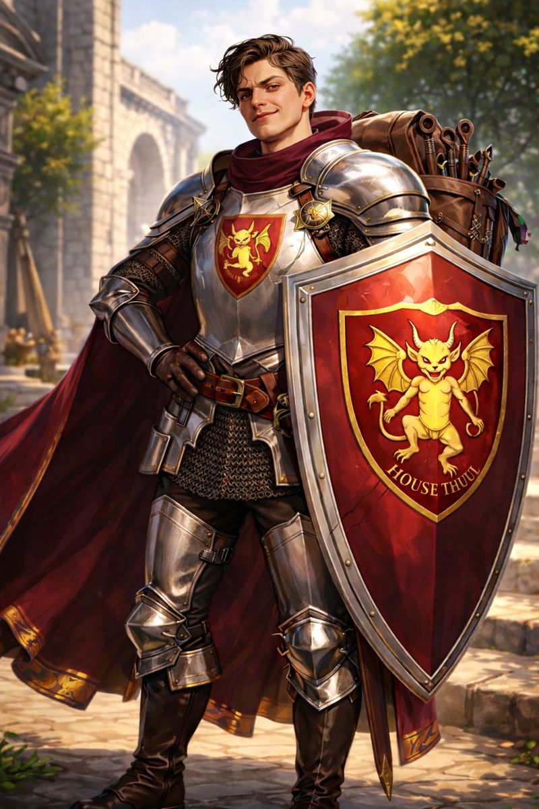

# Baxibillion Stravos III

{ width="50%" }

Played by: REDACTED

## Overview

**Physical characteristics:** 6' 2" (wears wedge boots that add ~3"). Human man in his mid-twenties. Bax looks like a rich piece of shit: tanned (despite living somewhere temperate), muscular in a lean way (not bulky). He took "roids" (a street-sold version of kobold scale sheddings, marketed as a fairy-dust strength enhancer). His armor is pristine (it has never seen battle), and the crest of the benevolent [House Thuul](../Factions/house-thuul.md) is pinned to his chainmail. His boots are polished, his helm shines like a mirror, and his scabbard is empty. He carries a spotless shield and a pack full of smith's tools (in case he ever has to make a new one). Moderately handsome; personality: ABYSMAL. He barely knows how to talk and may, just may, have erectile dysfunction (ED).

## Build

- **Class:** Fighter
- **Subclass:** Battle Master
- **Feats:** Skilled (Noble), Tough (Human)
- **Background:** Noble
- **Ability scores:** STR 18, DEX 14, CON 14, INT 9, WIS 6, CHA 12
- **Speed:** 30 ft.
- **AC:** 18
- **HP:** 41
- **PB:** +2

## Proficiencies

**Skills:** Acrobatics, Athletics, Deception, History, Intimidation, Perception, Performance, Persuasion  
**Saving throws:** Strength, Constitution

## Flaws

- ED.
- He knows his parents are disappointed in him; he failed his family's name.

## Backstory

Long after the [Long Winter](../Lore/long-winter.md), Baxibillion Stravos III was born into the Stravos line of [Kingsguard](../Organizations/kingsguard.md). As the only heir to their name, he was trained from an early age to become the next (and most loyal) of the king's and lords' bodyguards.

His parents were loving and attentive, but Bax still managed to fall on his head often enough (and shove enough sticks up his nose) that he developed a less-than-stellar attention span for noble academies and libraries. Thanks to his father's regimen of giant's milk, griffin eggs, and rare illegal roids (see above), Bax grew stronger and bigger than all of his classmates.

At 10, Bax began sparring with his father, learning to wield a sword with deadly, precise force. Bax was not very good, though, and his father (kind and gentle) let his son win again and again to make him feel better. Despite his poor swordsmanship, Bax moved in sync with his shield, never missing an opportunity to riposte or shove off a strong attack.

As Bax grew, his father began working for a new generous noble of [House Thuul](../Factions/house-thuul.md). Bax met [Nastenka](../NPCs/nastenka-thuul.md), the eldest daughter of the house, who was his age. Bax quickly began trying to impress her, but [Fydor](../NPCs/fydor-thuul.md) (the patriarch) often shooed him away for his immaturity and lack of intellect.

[House Thuul](../Factions/house-thuul.md) had been shunned during the [Long Winter](../Lore/long-winter.md), but years of repaying their debt with altruism and philanthropy had restored their good name. Orphanages and hospitals across the region bore the Thuul crest.

As Bax and Bax Sr. grew older, Bax officially became [Fydor](../NPCs/fydor-thuul.md)'s sole protector. Bax Sr. presented the family longsword as a gift, proud that the family legacy would continue. Bax assumed the job meant stopping assassins and thwarting master poisoners, but in practice it mostly meant standing silently while the old man fell asleep in his massive armchair-throne.

To pass the time (between admiring his muscles in the stained-glass reflection), Bax practiced his terrible swordplay, careful not to wake [Fydor](../NPCs/fydor-thuul.md). One day, while trying to admire himself and lunge with the longsword at the same time, Bax drove the blade straight through the throne and into [Fydor](../NPCs/fydor-thuul.md)'s chest.

Panicking as the patriarch screamed, Bax yanked the sword free, threw it through the stained-glass window he had been posing in, then punched himself across the face. When the family rushed in, they found a dead [Fydor](../NPCs/fydor-thuul.md), Bax on the floor, and shattered glass everywhere.

Bax claimed an assassin had burst in, sucker-punched him, stolen his sword, and slew the noble. When pressed for details, he (flustered) blamed "evil fey." [Nastenka](../NPCs/nastenka-thuul.md), in tears, finally stepped forward and told him: he must go, swear vengeance on the killer, and bring justice to the house.

"I swear it," Bax said. He grabbed his shield and fled the city, only stopping long enough for a night of drinking before fully leaving. (He also swore never to pick up a sword again; he did not want to make another whoopsie.)

## Related

- [House Thuul](../Factions/house-thuul.md)
- [Fydor Thuul](../NPCs/fydor-thuul.md)
- [Nastenka Thuul](../NPCs/nastenka-thuul.md)
- [Kingsguard](../Organizations/kingsguard.md)
- [The Long Winter](../Lore/long-winter.md)

## Backlinks

- [Fydor Thuul](../NPCs/fydor-thuul.md)
- [House Thuul](../Factions/house-thuul.md)
- [Kingsguard](../Organizations/kingsguard.md)
- [Nastenka Thuul](../NPCs/nastenka-thuul.md)
- [Player Characters](index.md)
- [The Long Winter](../Lore/long-winter.md)
